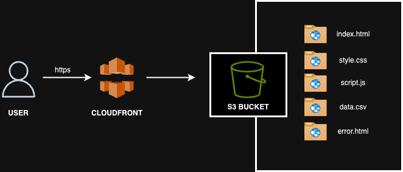
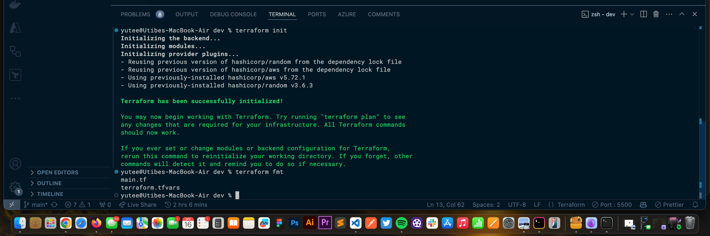
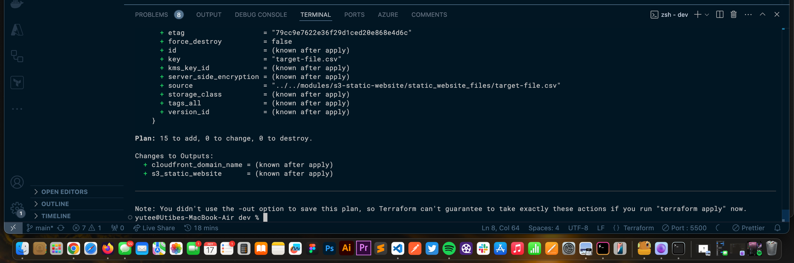
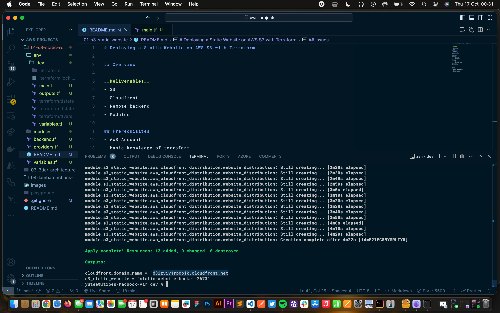
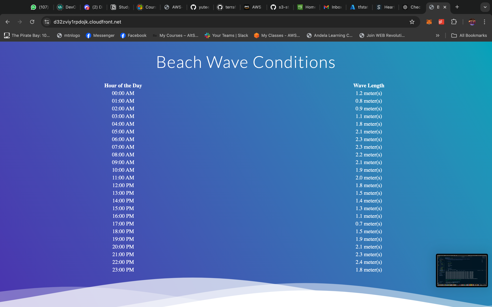
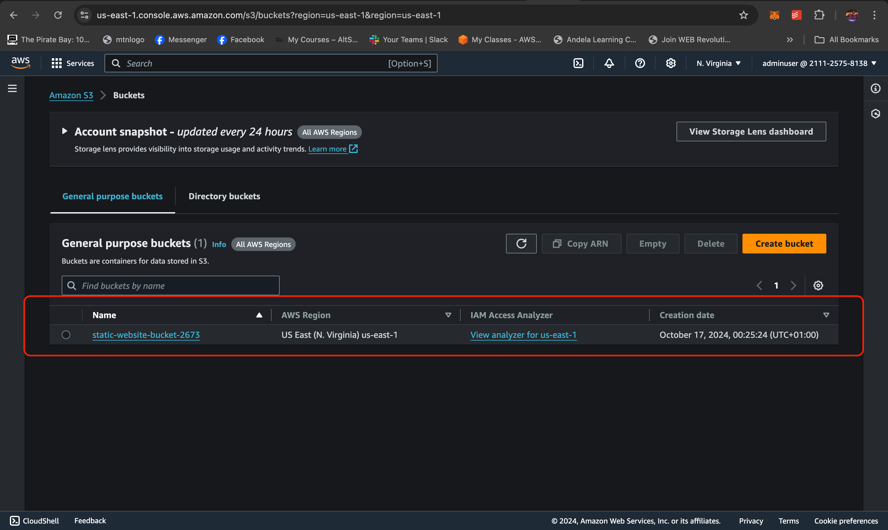

# Deploying a Static Website on AWS S3 with Terraform

## Overview
There is need to automate the deployment of a static website hosted using Amazon S3 bucket. Infrasctructure as Code (Iac) offers automation capapbilities, ensuring consistent and reuseable deployment. For this project, I will use terraform, an IaC tool to setup this deployment.

__Deliverables__
- Amazon S3 Bucket: S3 stores (and enables hosting for) the website content.
- Cloudfront Distribution: CloudFront distributes the content globally with caching and HTTPS support.
- Modules: Terraform Modules define the infrastructure setup (S3 + CloudFront). Ensuring reuseability.
- Remote backend: Remote Backend ensures your Terraform state is safely stored and accessible across teams for smooth collaboration

All resources will be provisioned using Terraform.

## Prerequisites
- AWS Account (configured on CLI)
- Basic knowledge of terraform modules

## Project Structure

```
project-root/
├── modules/
│   └── s3-static-website/
│       ├── main.tf
│       ├── variables.tf
│       └── outputs.tf
├── envs/
│   └── dev/
│       ├── main.tf
│       ├── variables.tf
│       └── terraform.tfvars
├── backend.tf
├── provider.tf
└── variables.tf

```

## Architecture Diagram


## Steps
- __Review Codebase:__ Go through the codebase and understand the different sections. The `modules` directory contains the `s3-static-website` module, here all the code for provisioning the necessary resources are defined in a way that it is reuseable across different environment, This technique aligns with the DRY concept. The `env` directory contains subdirectories for different environments. For this project, there is only the `dev` environment, but of course, other environments can be created and the module references to created seperate resources.

- __Confirm Setup:__ Update variables, confirm desired version, configure remote backend options (I used the azure blob storage as remote backend for this porject as it is more flexibale and automatically offers state file locking).

- __Run Commands:__
`terraform init`


`terraform plan`


`terraform apply -auto-approve`


- __Confirm Deliverables:__
_static website up_


_s3 bucket created_


_cloudfront created_


## Issues faced
__AWS Bucket Naming Convention:__ Encountered errors due to invalid S3 bucket names that violated AWS rules (e.g., uppercase letters or trailing hyphens). The issue was resolved by ensuring bucket names were all lowercase, within the character limit, and followed proper syntax.

__Dependency in Terraform:__ Resources were not created in the correct order, causing dependency conflicts. Dependencies were managed using depends_on and Terraform’s implicit dependencies to ensure proper resource creation.

__Passing Data Between Modules and the Root Module:__ Faced difficulties sharing variables and outputs between modules and the root module. This was resolved by defining module outputs and referencing them appropriately in the root configuration.

__Resource Block Options:__ Some resource blocks failed due to incorrect or missing configuration options. This was resolved by reviewing documentation and ensuring required attributes and parameters were correctly specified.

## Conclusion
This project demonstrates how to deploy a scalable and secure static website on AWS using an S3 bucket for storage, CloudFront for global content delivery, and Terraform for infrastructure as code. With a modular setup and remote backend for state management, the configuration ensures efficiency, reusability, and smooth collaboration. Happy Deploying!