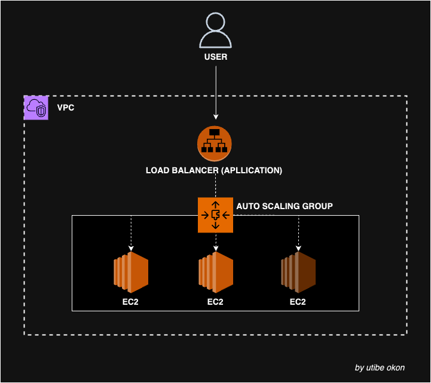
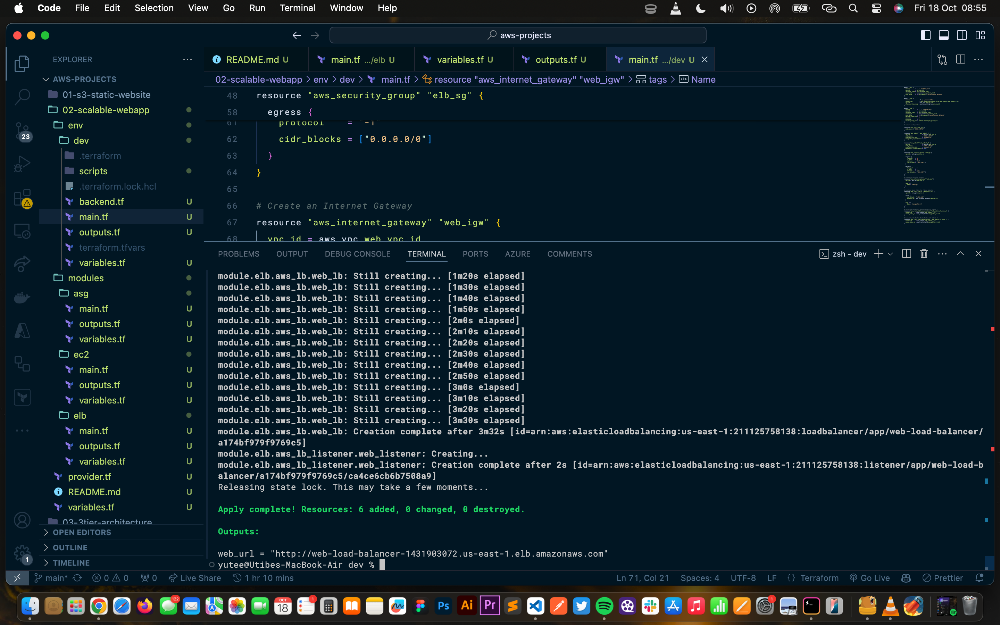
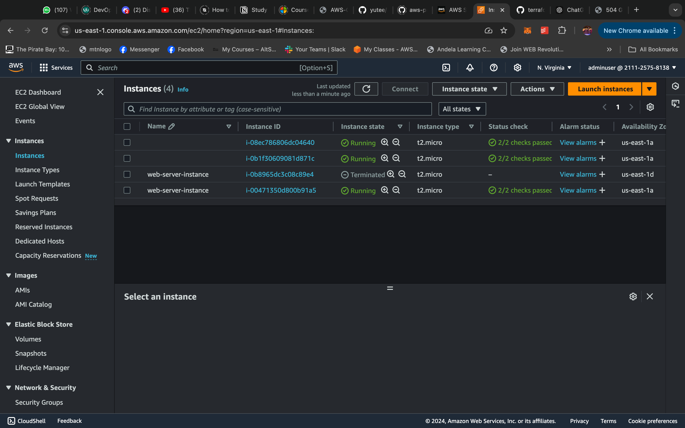
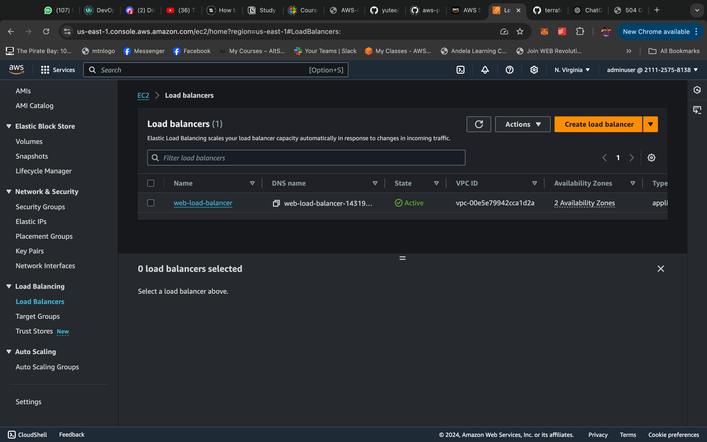
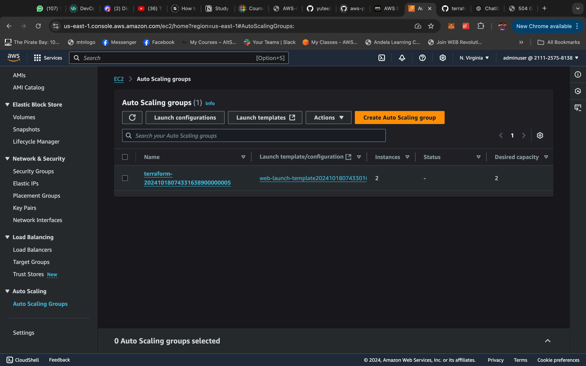

# Scalable Web Application with Auto Scaling on AWS

## Overview

A scalable web application is one that can adjust to meet demands of high traffic periods. TO achieve this, aws has a service called auto scaling groups, it handless the automatic scaling of application resources (ec2 instances in this case). Additionally, a load balancer is attached to it to handle traffic routing to healthy instances. This ensures no one isntance is overloaded while another sits idle.

In this project, I will be provisioning resources that meet this architecture setup.

__Deliverables__
- Launch Template
- Auto Scaling Group
- Application Load Balancer
- Modular Terraform
- Remote backend configuration (for state management)

## Architecture Diagram


## Project Structure
```
project-root/
├── modules/
│   ├── ec2/
│   │   ├── main.tf
│   │   ├── variables.tf
│   │   └── outputs.tf
│   ├── elb/
│   │   ├── main.tf
│   │   ├── variables.tf
│   │   └── outputs.tf
│   └── asg/
│       ├── main.tf
│       ├── variables.tf
│       └── outputs.tf
├── envs/
│   └── dev/
│       ├── main.tf
│       ├── variables.tf
│       └── terraform.tfvars
├── backend.tf
├── provider.tf
└── variables.tf
```

## Walkthrough
This setup can be recreated. Get the configuration files, update variables, setup environment and run:

```bash
terrafom init
terraform plan
terraform apply --auto-approve
```



__Confirm Resources__
_ec2_


_load balancer_


_auto scaling group_


## Conclusion
This project demonstrates how to efficiently deploy a scalable and highly available web application on AWS using Terraform. By leveraging EC2 instances in an Auto Scaling Group, an Application Load Balancer (ALB), and modular Terraform configurations, this setup ensures flexibility, resilience, and seamless traffic management.

With this infrastructure, you can easily manage growth, minimize downtime, and achieve reliable web service delivery. Future improvements can include enhanced security through private subnets, monitoring with CloudWatch, and automated CI/CD pipelines for continuous deployments.

Feel free to extend or modify the setup as needed to suit your use case! Happy Deploying!
