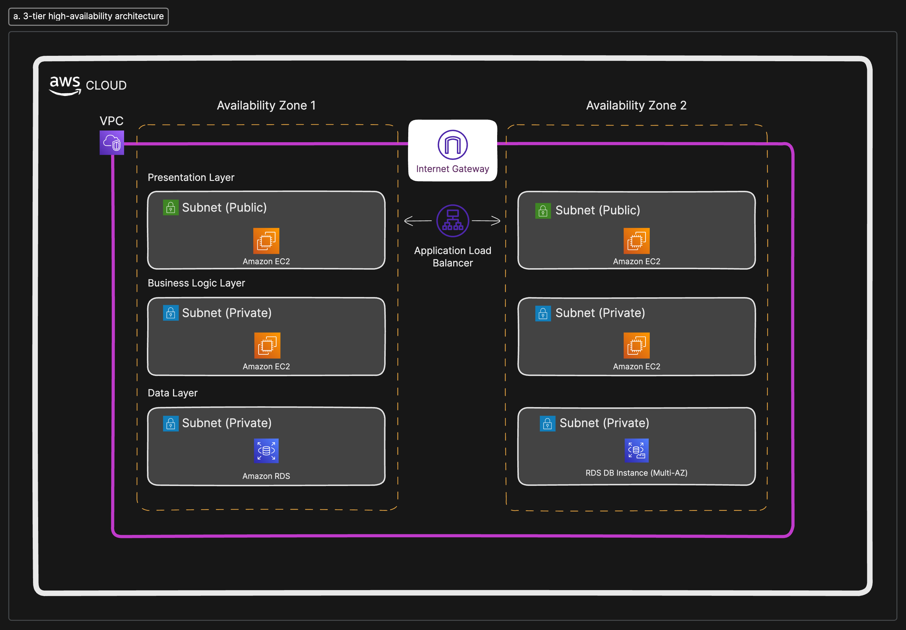

## Setting up  a 3-Tier Multi-Region Infrastructure

###  Overview
There is need to provsion infrastructure that will handle the deployment of a 3-tier application. It is recommended that the infrasctructure is setuo in a way that it is highly available. For the project, Infrasctructure as Code tool, Terraform is used and resources are provision on public cloud platform, AWS.

A 3-tier application is an application architecture where the application is divided into 3 layers. Presentation (frontend), business logic (backend), and data (database). This separation enhances security, scalability, and simplifies debugging. This project uses Terraform to design and provision an infrastructure suitable for deploying a 3-tier application across multiple AWS regions, ensuring high availability.

### Architecture and Resources
_Architecture diagram if the infrasctructure:_

As shown, several aws resources will be created using terrform, they include:
__- VPC and Subnets:__ A virtual network and 6 subnets. Two public subnets for the presentation layer and 4 for the database and business logic. 3 will be deployed into two availability zones.
__- EC2:__ Virtual machines deployed in public subnets and put behind a load balancer.
__- Internet Gateway:__ A pathway for resourcesin the vpc to reach the internet securely
__- Load Balancer:__ Spread incoming traffic amongs the available frontend tier servers.
__- Security Groups:__ To control traffic that gets to the public subnets where business and database tier is deployed.
__- Relational Database Service:__ Created with replicas in different regions.

### Terraform
considering the many resources i had to create, i decided to use a separate file for each resource. this way i can keep track of what is what and easily understand the resources i am creating. essentially, modules would be used and all the reosurces can be group into two higher level modules, networking and compute.

### Possible Pmprovements?
- [ ] Modularize the terraform code
- [ ] Use Environments
- [x] Ensure seperate availability zones for high availability
- [ ] Use aws for remote backend

### Final words
Building highly available infrasctructure can be a core, but with appropriate planning and leveraging Infrastructure as Code as we have seen, the seemingly herculean task can be a piece of cake. Now, there are still several improvements that can be made, as aws keep adding services, your team of engineers grow, your application scales or our business needs keep changing. But at the core, this setup is fully function and production ready.