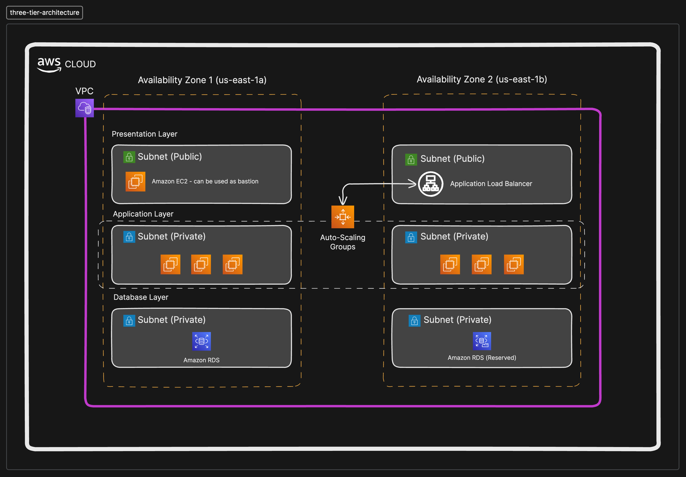
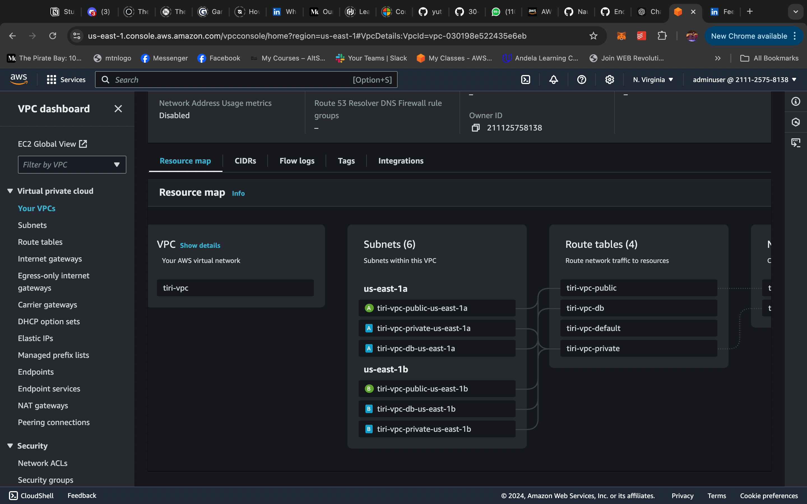
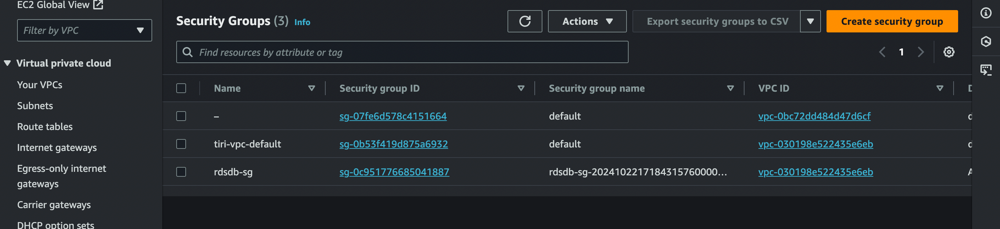
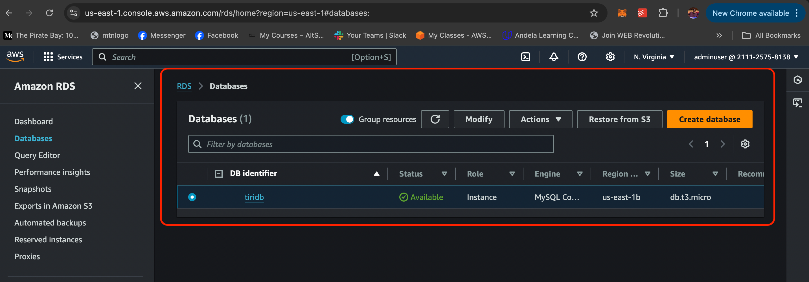
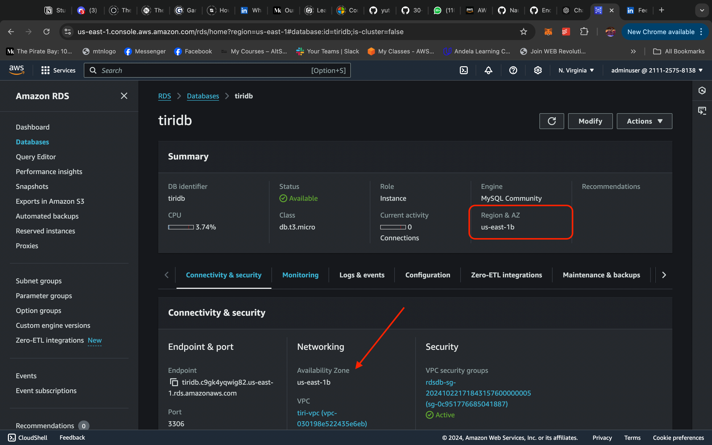
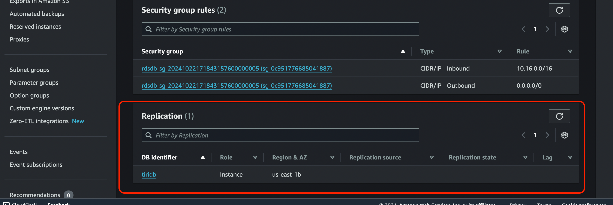

## Setting up  a 3-Tier Multi-Region Infrastructure

###  Overview
There is need to provsion infrastructure that will handle the deployment of a 3-tier application. It is recommended that the infrasctructure is setuo in a way that it is highly available. For the project, Infrasctructure as Code tool, Terraform is used and resources are provision on public cloud platform, AWS.

A 3-tier application is an application architecture where the application is divided into 3 layers. Presentation (frontend), business logic (backend), and data (database). This separation enhances security, scalability, and simplifies debugging. This project uses Terraform to design and provision an infrastructure suitable for deploying a 3-tier application across multiple AWS regions, ensuring high availability.

### Architecture and Resources
_Architecture diagram if the infrasctructure:_


As shown, several aws resources will be created using terrform, they include:
__- VPC and Subnets:__ A virtual network and 6 subnets. Two public subnets for the presentation layer and 4 for the database and business logic. 3 will be deployed into two availability zones.
__- EC2 and ASG:__ Virtual machines deployed in private subnets with the help of an ASG behind a load balancer.
__- Load Balancer:__ Spread incoming traffic amongs the available frontend tier servers.
__- Security Groups:__ To control traffic that gets to the public subnets where business and database tier is deployed.
__- Relational Database Service:__ Created with replicas in different availability zones and a read replica in a seperate region.

## Project Structure
```
project-root/
├── modules/
│   ├── ec2/
│   │   ├── main.tf
│   │   ├── variables.tf
│   │   └── outputs.tf
│   ├── vpc/
│   │   ├── main.tf
│   │   ├── variables.tf
│   │   └── outputs.tf
│   └── elb/
│       ├── main.tf
│       ├── variables.tf
│       └── outputs.tf
│   └── asg/
│       ├── main.tf
│       ├── variables.tf
│       └── outputs.tf
│   └── rds/
│       ├── main.tf
│       ├── variables.tf
│       └── outputs.tf
├── envs/
│   └── dev/
│       ├── main.tf
│       ├── variables.tf
│       └── terraform.tfvars
├── backend.tf
├── provider.tf
└── variables.tf
```

### Deploying
Clone the repo, update variables and set keys fro remote backend.
Ensure to be on the `env/dev/` directory and then run:

```bash
terrafrom init
terraform plan
terraform apply -auto-approve
```

Upon apply sucess, these resources will be created:






### Further Steps
- Modularize Appplication load balancer
- Multi-Region replica feature

### Final words
Building highly available infrasctructure can be a chore, but with appropriate planning and leveraging Infrastructure as Code as we have seen, the seemingly herculean task can be a piece of cake. Now, there are still several improvements that can be made, as aws keep adding services, your team of engineers grow, your application scales or our business needs keep changing. But at the core, this setup is fully function and production ready.