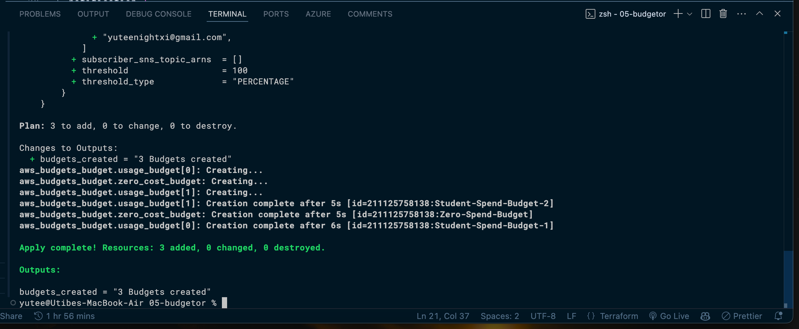
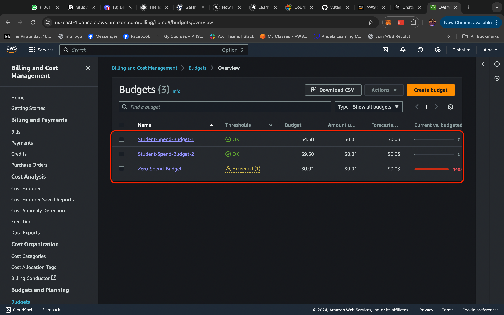

# Budgetor
## AWS Budget Alerts Configuration

This Terraform configuration sets up **AWS Budgets** to monitor and notify you about **costs** and **usage** in an AWS account. The configuration in simple an ideal for those using their AWS accounts for learning and do not hope to excede a certain amount in spending in a month. It is highly cutomizable and more various budget points can be setup as you want. 
It creates two types of budgets: 

1. **Zero-Cost Budget** – Notifies when any spending occurs.
2. **Usage Budget** – Monitors costs based on predefined amounts and sends alerts at specified thresholds.

---

## **Files Overview**

- **`main.tf`**: Defines the AWS budgets and their notification rules.
- **`variables.tf`**: Contains configurable variables such as budget amounts, thresholds, and email addresses.
- **`providers.tf`**: Sets up the AWS provider for Terraform.
- **`tfvars` (e.g., `terraform.tfvars`)**: Example variable values for quick reuse.
- **`output.tf`**: Outputs the number of budgets created.

---

## **How to Use**

### **1. Prerequisites**
- Install [Terrafrom](https://www.terraform.io/downloads).
- Configure AWS credentials on your machine (`aws configure`).
- Ensure appropriate IAM permissions to create AWS Budgets.

---

### **2. Setup Steps**
1. **Clone this repository**:
```bash
git clone
```

2. **Update Variables:**

Edit terraform.tfvars to set your custom values:

```hcl
amount = ["4.5", "9.5"]  # Budget limits (in USD)
notification_threshold = [100, 100]  # Thresholds as percentage
email_addresses = ["you@example.com", "team@example.com"]  # Email alerts
```

**Initialize Terraform and run code:**

```bash
terraform init
terraform plan
terraform apply -auto-approve
```

**View Outputs and Confirm Creation:**

After a successful deployment, you can view the number of budgets created and also confirm the budgets on using the console.




**Configurable Files**
`terraform.tfvars`: Adjust budget amounts, thresholds, and email recipients.
`variables.tf`: Modify default values or types if necessary.
`main.tf`: Customize the budget logic (optional).

**Cleanup**
To delete the resources created by this configuration, run:
```bash
terraform destroy -auto-approve
```

N/B: AWS Budgets is free for the first 62 active budgets in your account. After that, it costs $0.02 per budget per month. This applies to all types of budgets, including cost, usage, Reserved Instance (RI) utilization, Savings Plans utilization, and coverage budgets. Find more about budgets [here](https://docs.aws.amazon.com/cost-management/latest/userguide/budgets-managing-costs.html).

Contributions and improvements are welcome.
Feel free to use and modify it. Happy hacking!

